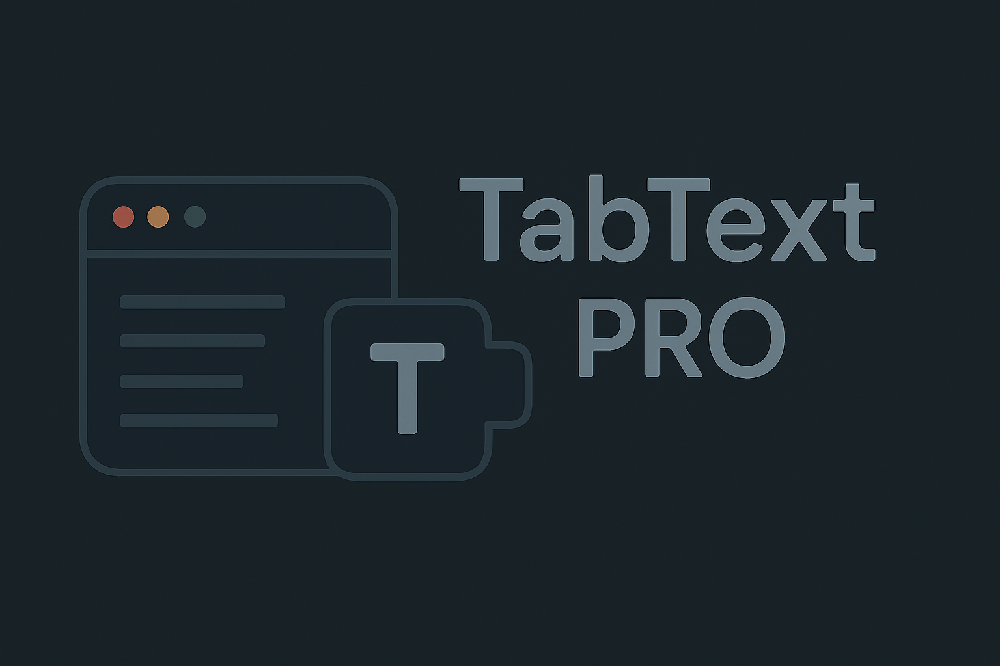

```
 ______   ______     ______     ______   ______     __  __     ______      ______   ______     ______    
/\__  _\ /\  __ \   /\  == \   /\__  _\ /\  ___\   /\_\_\_\   /\__  _\    /\  == \ /\  == \   /\  __ \   
\/_/\ \/ \ \  __ \  \ \  __<   \/_/\ \/ \ \  __\   \/_/\_\/_  \/_/\ \/    \ \  _-/ \ \  __<   \ \ \/\ \  
   \ \_\  \ \_\ \_\  \ \_____\    \ \_\  \ \_____\   /\_\/\_\    \ \_\     \ \_\    \ \_\ \_\  \ \_____\ 
    \/_/   \/_/\/_/   \/_____/     \/_/   \/_____/   \/_/\/_/     \/_/      \/_/     \/_/ /_/   \/_____/ 
```                                                                                                         

---

## Indice delle Lingue / Languages Index

**- 🇮🇹 [Italiano](#-descrizione)**

**- 🇺🇸 [English](#-description)**

**- 🇪🇸 [Español](#-descripción)**

**- 🇷🇺 [Русский](#-описание)**

**- 🇿🇭 [中文](#-描述)**

---

## 🇮🇹 Descrizione

TabText Pro è un editor di testo moderno, multi-tab, con funzionalità di salvataggio personalizzato e miglioramento del testo tramite intelligenza artificiale. Semplice, veloce e open source!

### Funzionalità principali

- **Salvataggio personalizzato**: puoi sempre scegliere il nome del file quando salvi
- **Multi-tab**: lavora su più documenti contemporaneamente
- **Miglioramento AI**: migliora il testo con un click (L'API di Mistral è gentilmente inclusa nel progetto, ma ti preghiamo di non utilizzarla per altri progetti. In caso contrario, saremo costretti a rimuoverla)
- **Trova e sostituisci**: ricerca e sostituisci testo facilmente
- **Tema chiaro/scuro**
- **Supporto multilingua**: Italiano e Inglese

---

### 1. Prerequisiti

Per eseguire TabText Pro hai bisogno di **Node.js** (versione 18 o superiore consigliata).

- Scarica Node.js dal sito ufficiale: [Node.js](https://nodejs.org/)
- Segui la procedura guidata di installazione per il tuo sistema operativo (Windows, Mac, Linux)
- Dopo l'installazione, apri il terminale (Prompt dei comandi su Windows, Terminale su Mac/Linux) e digita:
  ```sh
  node -v
  npm -v
  ```
  Se vedi dei numeri di versione, sei pronto!

### 2. Scarica TabText Pro

- Se hai **familiarità con Git**:
  ```sh
  git clone https://github.com/Criso99/tabtext-scribe-pro.git
  cd tabtext-scribe-pro
  ```
- Se **NON hai Git**:
  1. Vai su [TabText PRO](https://github.com/Criso99/tabtext-scribe-pro)
  2. Clicca su "Code" > "Download ZIP"
  3. Estrai la cartella dove preferisci
  4. Apri il terminale nella cartella estratta

### 3. Installa le dipendenze

Nel terminale, esegui:

```sh
npm install
```

Questo comando scarica tutto il necessario per far funzionare l'app.

### 4. Avvia l'applicazione

Sempre nel terminale:

```sh
npm run dev
```

Vedrai un link (di solito `http://localhost:8080`) su cui cliccare per aprire TabText Pro nel browser.

Apri il link sul tuo Browser e potrai usare TabText PRO

**Se non vuoi scaricare o installare nulla, puoi provare TabText Pro direttamente online qui:**  
👉 [TabText PRO](https://tabtext-scribe-pro.vercel.app)

**Se TabText Pro ti è piaciuto o ti è stato utile, lascia una ⭐️ al progetto! Il tuo supporto è importante e ci aiuta a continuare a migliorare e condividere nuove funzionalità.**

---

## 🇺🇸 Description

TabText Pro is a modern, multi-tab text editor with custom save and AI-powered text improvement. Simple, fast, and open source!

### Main Features

- **Custom Save**: always choose your file name when saving
- **Multi-tab**: work on multiple documents at once
- **AI Improvement**: enhance your text with one click (The Mistral API is kindly included within the project, but please do not use it for other projects or we will be forced to remove it)
- **Find & Replace**: easily search and replace text
- **Light/Dark theme**
- **Multilanguage**: Italian and English

---

### 1. Prerequisites

You need **Node.js** (version 18 or higher recommended).

- Download Node.js from the official website: [Node.js](https://nodejs.org/)
- Follow the installation wizard for your operating system (Windows, Mac, Linux)
- After installation, open your terminal (Command Prompt on Windows, Terminal on Mac/Linux) and type:
  ```sh
  node -v
  npm -v
  ```
  If you see version numbers, you're ready!

### 2. Download TabText Pro

- If you are **familiar with Git**:
  ```sh
  git clone https://github.com/Criso99/tabtext-scribe-pro.git
  cd tabtext-scribe-pro
  ```
- If you are **NOT familiar with Git**:
  1. Go to [TabText PRO](https://github.com/Criso99/tabtext-scribe-pro)
  2. Click "Code" > "Download ZIP"
  3. Extract the folder wherever you like
  4. Open your terminal in the extracted folder

### 3. Install dependencies

In the terminal, run:

```sh
npm install
```

This command downloads everything needed to run the app.

### 4. Start the app

Still in the terminal:

```sh
npm run dev
```

You will see a link (usually `http://localhost:8080`) to open TabText Pro in your browser.

Open the link in your browser and you can use TabText PRO

**If you don’t want to download or install anything, you can try TabText Pro directly online here:**  
👉 [TabText PRO](https://tabtext-scribe-pro.vercel.app)

**If you liked TabText Pro or found it useful, please leave a ⭐️ to the project! Your support is important and helps us continue to improve and share new features.**

---

## 🇪🇸 Descripción
TabText Pro es un editor de texto moderno, con múltiples pestañas, funciones de guardado personalizado y mejora de texto mediante inteligencia artificial. ¡Sencillo, rápido y de código abierto!

### Funcionalidades principales

- **Guardado personalizado**: siempre puedes elegir el nombre del archivo al guardar
- **Múltiples pestañas**: trabaja en varios documentos al mismo tiempo
- **Mejora con IA**: mejora el texto con un solo clic (La API de Mistral está incluida amablemente en el proyecto, pero por favor no la uses en otros proyectos. De lo contrario, nos veremos obligados a retirarla)
- **Buscar y reemplazar**: busca y reemplaza texto fácilmente
- **Tema claro/oscuro**
- **Soporte multilingüe**: Italiano e Inglés

### 1. Requisitos previos

Para ejecutar TabText Pro necesitas Node.js (se recomienda la versión 18 o superior).

- Descarga Node.js desde el sitio oficial: [Node.js](https://nodejs.org/)
- Sigue el asistente de instalación para tu sistema operativo (Windows, Mac, Linux)
- Después de la instalación, abre la terminal (Símbolo del sistema en Windows, Terminal en Mac/Linux) y escribe:

```sh
node -v
npm -v
```

Si ves los números de versión, ¡estás listo!

### 2. Descarga TabText Pro

- Si tienes **experiencia con Git**:

```sh
git clone https://github.com/Criso99/tabtext-scribe-pro.git
cd tabtext-scribe-pro
```
Si **NO tienes Git**:
1. Ve a [TabText PRO](https://github.com/Criso99/tabtext-scribe-pro)
2. Haz clic en "Code" > "Download ZIP"
3. Extrae la carpeta donde prefieras
4. Abre la terminal en la carpeta extraída

### 3. Instala las dependencias

En la terminal, ejecuta:

```sh
npm install
```

Este comando descargará todo lo necesario para que la app funcione.

### 4. Inicia la aplicación

También en la terminal:

```sh
npm run dev
```

Verás un enlace (normalmente http://localhost:8080) en el que puedes hacer clic para abrir TabText Pro en tu navegador.

Abre el enlace en tu navegador y podrás usar TabText PRO.

**Si no quieres descargar ni instalar nada, puedes probar TabText Pro directamente en línea aquí:**
👉 [TabText PRO](https://tabtext-scribe-pro.vercel.app)

**Si TabText Pro te gustó o te fue útil, ¡déjanos una ⭐️ en el proyecto! Tu apoyo es importante y nos ayuda a seguir mejorando y compartiendo nuevas funcionalidades.**

## 🇷🇺 Описание

TabText Pro — это современный многофункциональный текстовый редактор с поддержкой нескольких вкладок, возможностью индивидуального сохранения и улучшения текста с помощью искусственного интеллекта. Простой, быстрый и с открытым исходным кодом!

### Основные функции

- **Индивидуальное сохранение**: вы всегда можете выбрать имя файла при сохранении
- **Мультивкладки**: работайте с несколькими документами одновременно
- **AI-улучшение**: улучшайте текст одним кликом (API Mistral любезно включено в проект, но, пожалуйста, не используйте его для других проектов. В противном случае мы будем вынуждены его удалить)
- **Поиск и замена**: легко ищите и заменяйте текст
- **Светлая/тёмная тема**
- **Мультиязычная поддержка**: итальянский и английский языки

---

### 1. Необходимые условия

Для запуска TabText Pro вам понадобится **Node.js** (рекомендуется версия 18 или выше).

- Скачайте Node.js с официального сайта: [Node.js](https://nodejs.org/)
- Следуйте инструкции по установке для вашей операционной системы (Windows, Mac, Linux)
- После установки откройте терминал (Командная строка в Windows, Терминал в Mac/Linux) и введите:
  ```sh
  node -v
  npm -v
  ```
  Если вы видите номера версий, вы готовы!

### 2. Скачайте TabText Pro

- Если вы **знакомы с Git**:
  ```sh
  git clone https://github.com/Criso99/tabtext-scribe-pro.git
  cd tabtext-scribe-pro
  ```
- Если **НЕ знакомы с Git**:
  1. Перейдите на [TabText PRO](https://github.com/Criso99/tabtext-scribe-pro)
  2. Нажмите "Code" > "Download ZIP"
  3. Извлеките папку в удобное место
  4. Откройте терминал в извлечённой папке

### 3. Установите зависимости

В терминале выполните:

```sh
npm install
```

Эта команда скачает всё необходимое для работы приложения.

### 4. Запустите приложение

Также в терминале:

```sh
npm run dev
```

Вы увидите ссылку (обычно `http://localhost:8080`), по которой можно открыть TabText Pro в браузере.

Откройте ссылку в вашем браузере и сможете использовать TabText PRO

**Если вы не хотите ничего скачивать или устанавливать, вы можете попробовать TabText Pro онлайн здесь:**  
👉 [TabText PRO](https://tabtext-scribe-pro.vercel.app)

**Если TabText Pro вам понравился или оказался полезен, поставьте ⭐️ проекту! Ваша поддержка важна и помогает нам продолжать улучшать и добавлять новые функции.**

---

## 🇿🇭 描述

TabText Pro 是一款现代化的多标签文本编辑器，支持自定义保存和通过人工智能提升文本质量。简单、快速且开源！

### 主要功能

- **自定义保存**：保存时可随时选择文件名
- **多标签页**：可同时处理多个文档
- **AI 增强**：一键提升文本（Mistral API 已包含在项目中，但请勿将其用于其他项目，否则我们将不得不移除）
- **查找和替换**：轻松查找和替换文本
- **明暗主题切换**
- **多语言支持**：意大利语和英语

---

### 1. 先决条件

运行 TabText Pro 需要 **Node.js**（建议版本 18 或更高）。

- 从官网下载 Node.js：[Node.js](https://nodejs.org/)
- 按照你的操作系统（Windows、Mac、Linux）完成安装
- 安装完成后，打开终端（Windows 下为命令提示符，Mac/Linux 下为终端），输入：
  ```sh
  node -v
  npm -v
  ```
  如果看到版本号，说明准备就绪！

### 2. 下载 TabText Pro

- 如果你**熟悉 Git**：
  ```sh
  git clone https://github.com/Criso99/tabtext-scribe-pro.git
  cd tabtext-scribe-pro
  ```
- 如果**不熟悉 Git**：
  1. 访问 [TabText PRO](https://github.com/Criso99/tabtext-scribe-pro)
  2. 点击“Code” > “Download ZIP”
  3. 将文件夹解压到你喜欢的位置
  4. 在解压后的文件夹中打开终端

### 3. 安装依赖

在终端中执行：

```sh
npm install
```

该命令会下载应用运行所需的全部内容。

### 4. 启动应用

依然在终端中：

```sh
npm run dev
```

你会看到一个链接（通常是 `http://localhost:8080`），点击即可在浏览器中打开 TabText Pro。

在浏览器中打开链接即可使用 TabText PRO

**如果你不想下载或安装任何内容，可以直接在线体验 TabText Pro：**  
👉 [TabText PRO](https://tabtext-scribe-pro.vercel.app)

**如果你喜欢或觉得 TabText Pro 有用，请为项目点个 ⭐️！你的支持对我们很重要，能帮助我们持续改进和推出新功能。**

---


## Link Utili / Useful Links / Enlaces útiles / Полезные ссылки / 实用链接

- [Node.js Download](https://nodejs.org/)
- [Git Download](https://git-scm.com/downloads)
- [TabText Pro Repository](https://github.com/Criso99/tabtext-scribe-pro)
- [TabText Pro Website](https://tabtext-scribe-pro.vercel.app)
  
---

<p align="center">
  <b>Made with 🤍 by a 14-year-old</b>
</p>

<p align="center">
  
</p>
